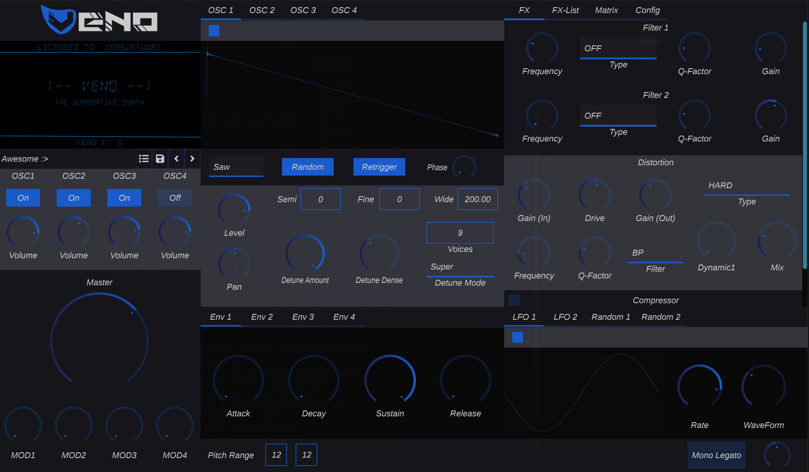

# VeNo




VeNo started as a pure learning project for C ++ and the understanding of how synths and audio processing work.

The learning project turned into the dream of a new open source synthesizer which offers enough features for newcomers

## Features

- 4 Oscillators
- 2 LFOs
- 2 Random Generator
- Dual Filter
- Distortion
- Compressor
- GUI
    - Layoutable GUI via .vui files (or let them default :P)
    - Colorable GUI
  
## GUI-Lang

VeNo use a custom-written Layout language to optimize the relayouting for me

Why selfwritten? because of learning perspective and not happy with pre-solutions

For information look into: DOCS/GUILang.md

## Build

For building you need:
- CMake `3.16 or Newer`
- Compiler (MSVC, GCC, Clang)
- Visual Studio (Windows only)
- Terminal :P

### Windows
```
mkdir build
cd build
cmake ..
```
Then open the .sln file inside the build directory with Visual Studio.
Select Start Project -> VST3
Build :>

### Linux
```
mkdir build
cd build
// For Release
cmake -DCMAKE_BUILD_TYPE=Release ..
// For Debug
cmake -DCMAKE_BUILD_TYPE=Debug ..

make -j${nproc}
```


### MacOS

```
mkdir build
cd build
// For Release
cmake -DCMAKE_BUILD_TYPE=Release ..
// For Debug
cmake -DCMAKE_BUILD_TYPE=Debug ..

make -j${nproc}
```
